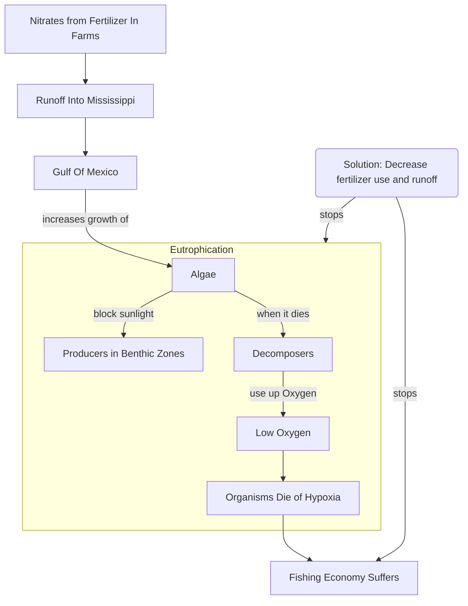

```mermaid
graph TD
  nitrates[Nitrates from Fertilizer In Farms]
  runoff[Runoff Into Mississippi]
	gulf[Gulf Of Mexico]
	nitrates--> runoff --> gulf -->|increases growth of|Algae
	subgraph "Eutrophication"
		Algae -->|block sunlight|benthic[Producers in Benthic Zones]
		Algae -->|when it dies|Decomposers
		Decomposers -->|use up Oxygen|o2[Low Oxygen]
		o2 --> death[Organisms Die of Hypoxia]
	end
death --> economy[Fishing Economy Suffers]
	solution(Solution: Decrease fertilizer use and runoff)
	solution -->|stops|Eutrophication
	solution -->|stops|economy
```

